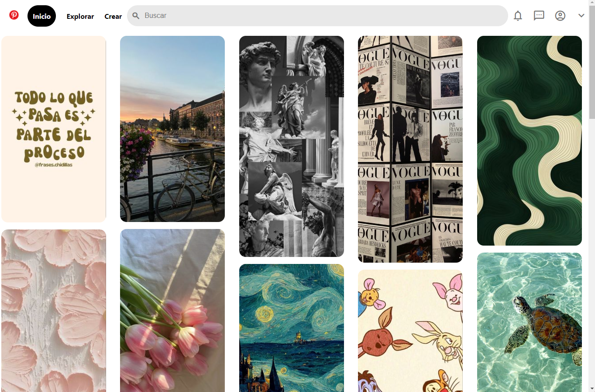

# Clon de Pinterest con HTML y CSS
Este proyecto es un clon de la interfaz de usuario de Pinteres, creado puramente con HTML5 y CSS3.

Se enfonca en replicar la apariencia visual de Pinterest, ofreciendo una experiencia de navegación similar un diseño responsive y funcionalidades básicas. 

### Características

* **Diseño Responsive:** Adaptable a diferentes tamaños de pantalla, para una experiencia de usuario óptima en dispositivos móviles y de escritorios.
  
* **Intefaz de Usuario Intuitiva:** Inspirada en Pinterest, con una navegación fácil y accesible.

* **Interacciones Dinámicas:** Efectos visuales para elementos interactivos como botones y enlace.

*  **Iconografía y estilos modernos:** Uso de la biblioteca de íconos de Material Design y estilos CSS modernos para una apariencia cool.

### Teconologías utilizadas

+ **HTML5:** Para la esctructura básica del sitio.
+ **CSS3:** Para el diseño y el estilo, influyendo _flexbox_ para un diseñor responsivo y efectos de _hover_.

### Vista Previa del Proyecto

### Contacto
Si te gustaría invitarme a colaborar en un proyecto, contáctame, escribeme por [LinkedIn](www.linkedin.com/in/leticia-gamboa-mendoza-69a9b9227/). 

O puedes contactarme a mi correo electronico: letygam88@gmail.com
  
